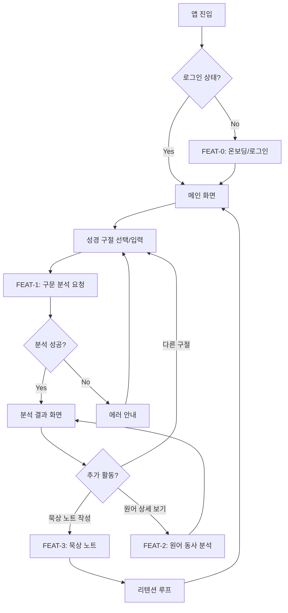
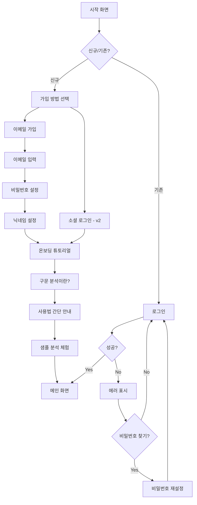
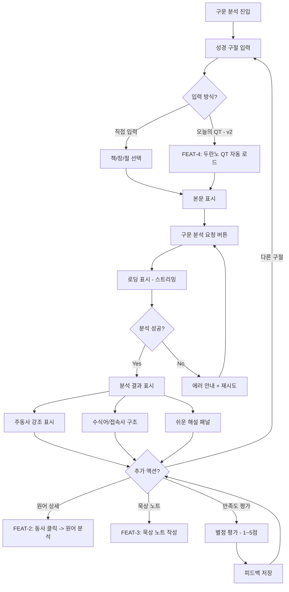
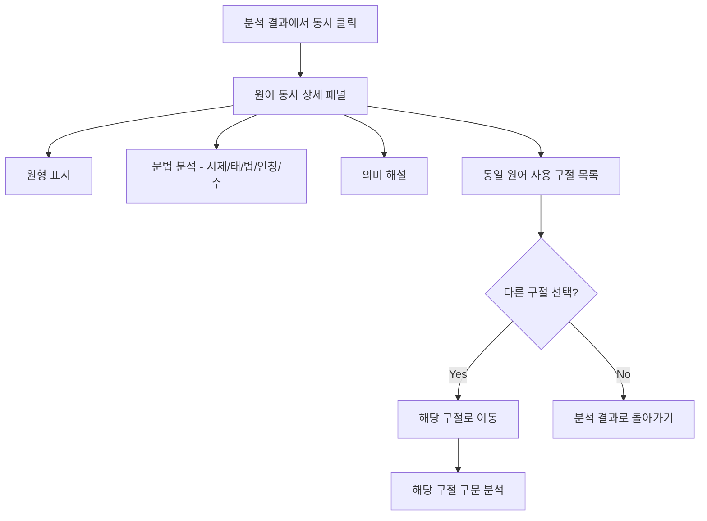
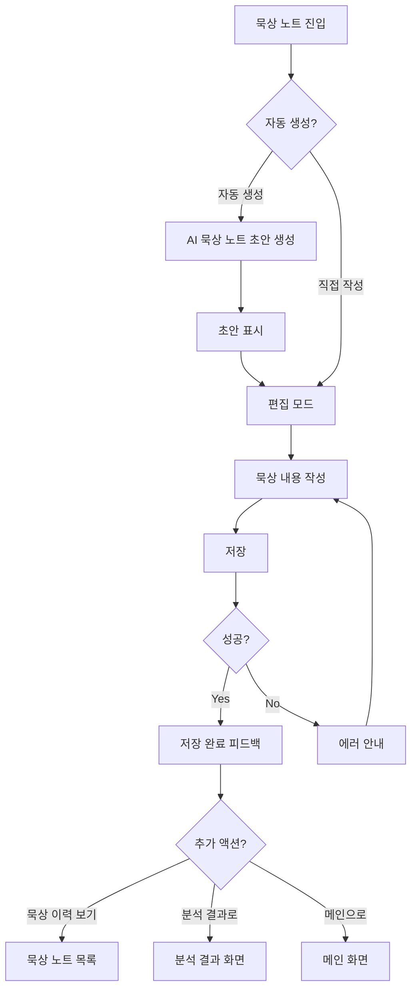
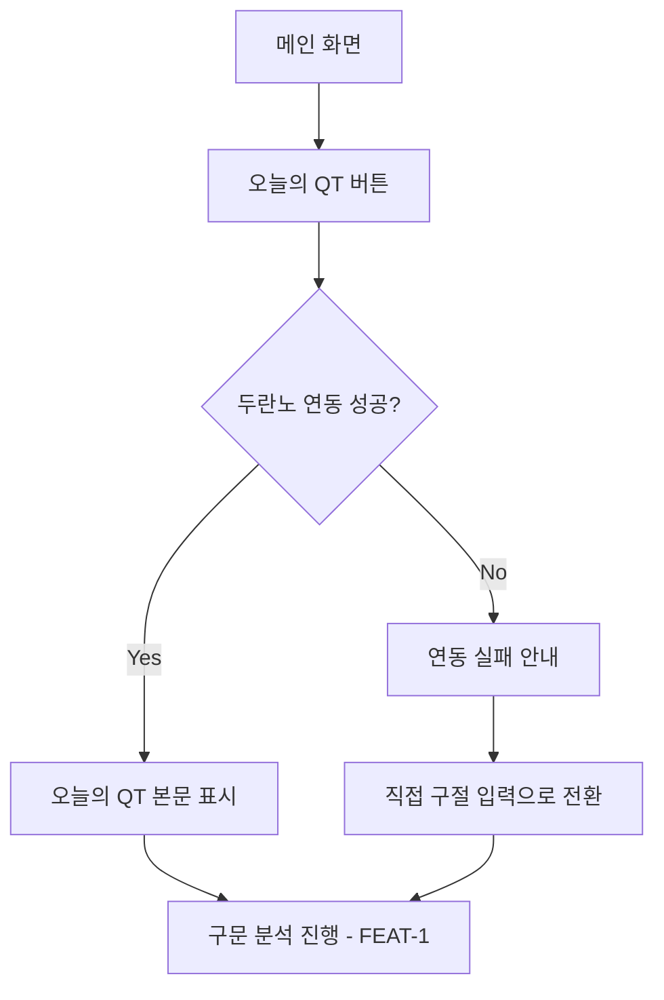
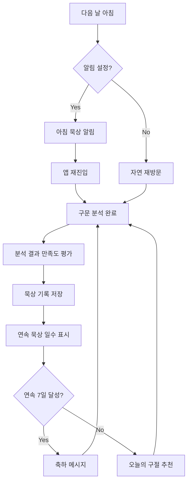
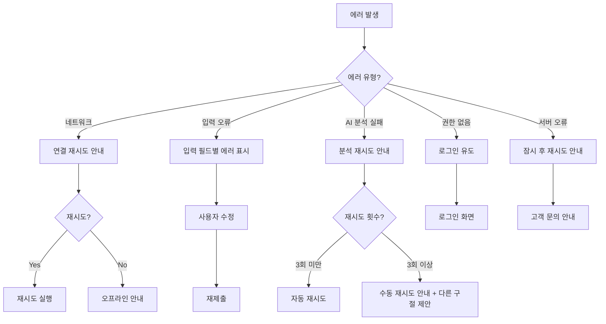

# User Flow (사용자 흐름도) - beeSvat

> Mermaid 플로우차트로 핵심 기능의 주요 여정을 표현합니다.
> 성공/실패 분기를 포함하고, 온보딩 -> 핵심작업 -> 리텐션 루프를 표현합니다.

---

## MVP 캡슐

| #   | 항목                 | 내용                                                                         |
| --- | -------------------- | ---------------------------------------------------------------------------- |
| 1   | 목표                 | 성경 본문의 구문 구조를 자동 분석하여 초보자도 깊은 묵상을 할 수 있게 돕는다 |
| 2   | 페르소나             | 일반 신자/성경 묵상자 (원어 지식 없는 분)                                    |
| 3   | 핵심 기능            | FEAT-1: 성경 구문 분석 (주동사/수식어 자동 파싱 & 해설)                      |
| 4   | 성공 지표 (노스스타) | 주간 활성 사용자 수                                                          |
| 5   | 입력 지표            | 사용자 만족도 (4.5점 이상)                                                   |
| 6   | 비기능 요구          | 모바일 3초 이내 로딩, 반응형 웹앱                                            |
| 7   | Out-of-scope         | 원어 사전 기능, 소셜 기능, 결제 시스템                                       |
| 8   | Top 리스크           | 구문 분석 AI의 정확도                                                        |
| 9   | 완화/실험            | 개혁신학 관점 검증자 리뷰 프로세스                                           |
| 10  | 다음 단계            | 기획 문서 6종 생성 후 FEAT-1 프로토타입 개발                                 |

---

## 1. 전체 사용자 여정 (Overview)

---

## 2. FEAT-0: 온보딩/로그인 플로우

---

## 3. FEAT-1: 성경 구문 분석 플로우 (MVP 핵심)

---

## 4. FEAT-2: 원어 동사 분석 플로우 (v2)

---

## 5. FEAT-3: 묵상 노트 플로우 (v2)

---

## 6. FEAT-4: 성경 본문 자동 가져오기 플로우 (v2)

---

## 7. 리텐션 루프 (습관 형성)

---

## 8. 에러 처리 플로우

---

## 9. 화면 목록 (Screen Inventory)

| 화면 ID | 화면명          | FEAT   | 진입점     | 주요 액션                         | MVP |
| ------- | --------------- | ------ | ---------- | --------------------------------- | --- |
| S-01    | 시작 화면       | FEAT-0 | 앱 실행    | 로그인/가입 선택                  | O   |
| S-02    | 로그인          | FEAT-0 | S-01       | 이메일 로그인                     | O   |
| S-03    | 회원가입        | FEAT-0 | S-01       | 이메일 계정 생성                  | O   |
| S-04    | 온보딩 튜토리얼 | FEAT-0 | S-03       | 사용법 안내, 샘플 체험            | O   |
| S-05    | 메인 화면       | -      | S-02, S-04 | 구절 입력, QT 본문 로드           | O   |
| S-06    | 구문 분석 결과  | FEAT-1 | S-05       | 구조 확인, 해설 읽기, 만족도 평가 | O   |
| S-07    | 원어 동사 상세  | FEAT-2 | S-06       | 원어 분석 확인, 참조 구절 이동    | -   |
| S-08    | 묵상 노트 작성  | FEAT-3 | S-06       | 노트 작성/편집/저장               | -   |
| S-09    | 묵상 노트 목록  | FEAT-3 | S-05, S-08 | 이력 조회, 노트 선택              | -   |
| S-10    | 오늘의 QT       | FEAT-4 | S-05       | QT 본문 확인, 분석 진행           | -   |
| S-11    | 프로필/설정     | FEAT-0 | S-05       | 알림 설정, 계정 관리              | O   |
| S-12    | 에러 화면       | 공통   | 모든 화면  | 에러 안내, 재시도                 | O   |

---

## Decision Log

| #     | 일자       | 결정 사항                           | 이유                                                    |
| ----- | ---------- | ----------------------------------- | ------------------------------------------------------- |
| UF-01 | 2026-02-26 | 온보딩에 샘플 분석 체험 포함        | 구문 분석이 생소한 개념이므로 실제 체험이 이해에 효과적 |
| UF-02 | 2026-02-26 | 만족도 평가를 분석 결과 화면에 배치 | 입력 지표(만족도 4.5점) 측정을 위한 자연스러운 접점     |
| UF-03 | 2026-02-26 | AI 분석 중 스트리밍 로딩            | 분석 시간(최대 5초)에 대한 사용자 체감 대기시간 감소    |
