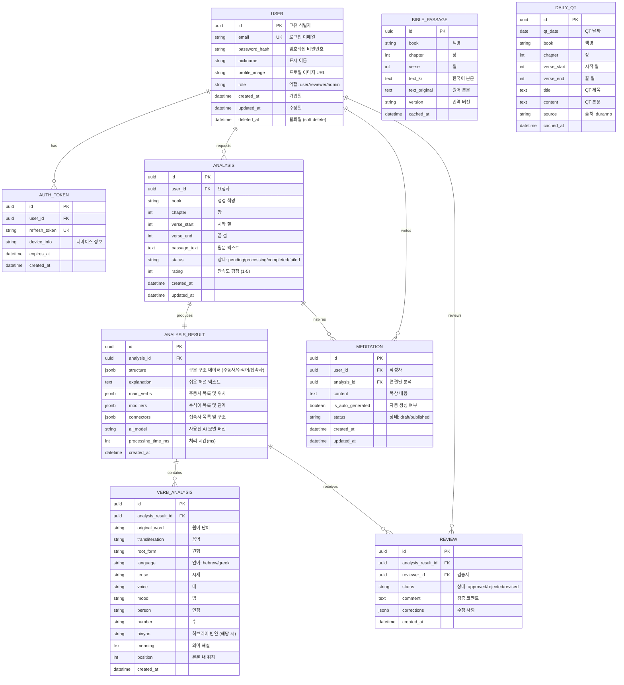
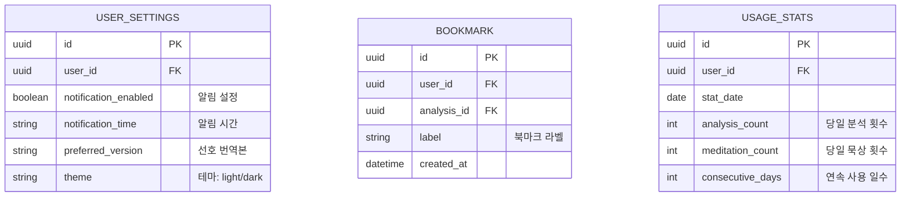

# Database Design (데이터베이스 설계) - beeSvat

> Mermaid ERD로 주요 엔티티와 관계를 표현합니다.
> 각 엔티티에 FEAT 주석을 달아 어떤 기능에서 사용되는지 명시합니다.
> 최소 수집 원칙을 반영하여 불필요한 개인정보는 지양합니다.

---

## MVP 캡슐

| #   | 항목                 | 내용                                                                         |
| --- | -------------------- | ---------------------------------------------------------------------------- |
| 1   | 목표                 | 성경 본문의 구문 구조를 자동 분석하여 초보자도 깊은 묵상을 할 수 있게 돕는다 |
| 2   | 페르소나             | 일반 신자/성경 묵상자 (원어 지식 없는 분)                                    |
| 3   | 핵심 기능            | FEAT-1: 성경 구문 분석 (주동사/수식어 자동 파싱 & 해설)                      |
| 4   | 성공 지표 (노스스타) | 주간 활성 사용자 수                                                          |
| 5   | 입력 지표            | 사용자 만족도 (4.5점 이상)                                                   |
| 6   | 비기능 요구          | 모바일 3초 이내 로딩, 반응형 웹앱                                            |
| 7   | Out-of-scope         | 원어 사전 기능, 소셜 기능, 결제 시스템                                       |
| 8   | Top 리스크           | 구문 분석 AI의 정확도                                                        |
| 9   | 완화/실험            | 개혁신학 관점 검증자 리뷰 프로세스                                           |
| 10  | 다음 단계            | 기획 문서 6종 생성 후 FEAT-1 프로토타입 개발                                 |

---

## 1. ERD (Entity Relationship Diagram)



---

## 2. 엔티티 상세 정의

### 2.1 USER (사용자) - FEAT-0

| 컬럼          | 타입         | 제약조건                      | 설명                      |
| ------------- | ------------ | ----------------------------- | ------------------------- |
| id            | UUID         | PK, DEFAULT gen_random_uuid() | 고유 식별자               |
| email         | VARCHAR(255) | UNIQUE, NOT NULL              | 로그인 이메일             |
| password_hash | VARCHAR(255) | NULL 허용                     | 소셜 로그인 시 NULL       |
| nickname      | VARCHAR(50)  | NOT NULL                      | 표시 이름                 |
| profile_image | VARCHAR(500) | NULL                          | 프로필 이미지 URL         |
| role          | VARCHAR(20)  | NOT NULL, DEFAULT 'user'      | 역할: user/reviewer/admin |
| created_at    | TIMESTAMPTZ  | NOT NULL, DEFAULT NOW()       | 가입일                    |
| updated_at    | TIMESTAMPTZ  | NOT NULL, DEFAULT NOW()       | 최종 수정일               |
| deleted_at    | TIMESTAMPTZ  | NULL                          | Soft delete용             |

**인덱스:**

- `idx_user_email` ON email (UNIQUE)
- `idx_user_role` ON role
- `idx_user_deleted_at` ON deleted_at (부분 인덱스: WHERE deleted_at IS NULL)

**최소 수집 원칙 적용:**

- 필수: email, nickname
- 선택: profile_image
- 수집 안 함: 전화번호, 주소, 생년월일 (필요 없음)

### 2.2 ANALYSIS (구문 분석 요청) - FEAT-1

| 컬럼         | 타입        | 제약조건                                  | 설명                                      |
| ------------ | ----------- | ----------------------------------------- | ----------------------------------------- |
| id           | UUID        | PK, DEFAULT gen_random_uuid()             | 고유 식별자                               |
| user_id      | UUID        | FK -> USER.id, NOT NULL                   | 요청자                                    |
| book         | VARCHAR(50) | NOT NULL                                  | 성경 책명 (예: 창세기, 요한복음)          |
| chapter      | INTEGER     | NOT NULL, CHECK(chapter > 0)              | 장                                        |
| verse_start  | INTEGER     | NOT NULL, CHECK(verse_start > 0)          | 시작 절                                   |
| verse_end    | INTEGER     | NOT NULL, CHECK(verse_end >= verse_start) | 끝 절                                     |
| passage_text | TEXT        | NOT NULL                                  | 분석 대상 원문 텍스트                     |
| status       | VARCHAR(20) | NOT NULL, DEFAULT 'pending'               | 상태: pending/processing/completed/failed |
| rating       | SMALLINT    | NULL, CHECK(rating BETWEEN 1 AND 5)       | 사용자 만족도 평점                        |
| created_at   | TIMESTAMPTZ | NOT NULL, DEFAULT NOW()                   | 생성일                                    |
| updated_at   | TIMESTAMPTZ | NOT NULL, DEFAULT NOW()                   | 수정일                                    |

**인덱스:**

- `idx_analysis_user_id` ON user_id
- `idx_analysis_status` ON status
- `idx_analysis_created_at` ON created_at DESC
- `idx_analysis_book_chapter` ON (book, chapter)
- `idx_analysis_rating` ON rating (부분 인덱스: WHERE rating IS NOT NULL)

### 2.3 ANALYSIS_RESULT (구문 분석 결과) - FEAT-1

| 컬럼               | 타입         | 제약조건                            | 설명                                              |
| ------------------ | ------------ | ----------------------------------- | ------------------------------------------------- |
| id                 | UUID         | PK, DEFAULT gen_random_uuid()       | 고유 식별자                                       |
| analysis_id        | UUID         | FK -> ANALYSIS.id, UNIQUE, NOT NULL | 분석 요청 참조 (1:1)                              |
| structure          | JSONB        | NOT NULL                            | 전체 구문 구조 데이터                             |
| explanation        | TEXT         | NOT NULL                            | 쉬운 해설 텍스트                                  |
| main_verbs         | JSONB        | NOT NULL                            | 주동사 목록 [{word, position, meaning, original}] |
| modifiers          | JSONB        | NOT NULL                            | 수식어 목록 [{word, type, target, position}]      |
| connectors         | JSONB        | NOT NULL                            | 접속사 목록 [{word, type, connects, position}]    |
| ai_model           | VARCHAR(100) | NOT NULL                            | 사용된 AI 모델 버전                               |
| processing_time_ms | INTEGER      | NOT NULL                            | 처리 소요 시간(ms)                                |
| created_at         | TIMESTAMPTZ  | NOT NULL, DEFAULT NOW()             | 생성일                                            |

**인덱스:**

- `idx_result_analysis_id` ON analysis_id (UNIQUE)
- GIN 인덱스: `idx_result_main_verbs` ON main_verbs (JSONB 검색용)

### 2.4 VERB_ANALYSIS (원어 동사 분석) - FEAT-2

| 컬럼               | 타입         | 제약조건                                         | 설명                                 |
| ------------------ | ------------ | ------------------------------------------------ | ------------------------------------ |
| id                 | UUID         | PK, DEFAULT gen_random_uuid()                    | 고유 식별자                          |
| analysis_result_id | UUID         | FK -> ANALYSIS_RESULT.id, NOT NULL               | 분석 결과 참조                       |
| original_word      | VARCHAR(100) | NOT NULL                                         | 원어 단어 (히브리어/헬라어)          |
| transliteration    | VARCHAR(100) | NOT NULL                                         | 음역                                 |
| root_form          | VARCHAR(100) | NOT NULL                                         | 원형 (사전형)                        |
| language           | VARCHAR(10)  | NOT NULL, CHECK(language IN ('hebrew', 'greek')) | 언어                                 |
| tense              | VARCHAR(50)  | NULL                                             | 시제 (Perfect, Imperfect, Aorist 등) |
| voice              | VARCHAR(50)  | NULL                                             | 태 (Active, Middle, Passive)         |
| mood               | VARCHAR(50)  | NULL                                             | 법 (Indicative, Subjunctive 등)      |
| person             | VARCHAR(10)  | NULL                                             | 인칭 (1st, 2nd, 3rd)                 |
| number             | VARCHAR(10)  | NULL                                             | 수 (Singular, Plural)                |
| binyan             | VARCHAR(30)  | NULL                                             | 히브리어 빈얀 (Qal, Niphal 등)       |
| meaning            | TEXT         | NOT NULL                                         | 의미 해설                            |
| position           | INTEGER      | NOT NULL                                         | 본문 내 위치 (문자 인덱스)           |
| created_at         | TIMESTAMPTZ  | NOT NULL, DEFAULT NOW()                          | 생성일                               |

**인덱스:**

- `idx_verb_result_id` ON analysis_result_id
- `idx_verb_root_form` ON root_form
- `idx_verb_language` ON language

### 2.5 MEDITATION (묵상 노트) - FEAT-3

| 컬럼              | 타입        | 제약조건                      | 설명                       |
| ----------------- | ----------- | ----------------------------- | -------------------------- |
| id                | UUID        | PK, DEFAULT gen_random_uuid() | 고유 식별자                |
| user_id           | UUID        | FK -> USER.id, NOT NULL       | 작성자                     |
| analysis_id       | UUID        | FK -> ANALYSIS.id, NULL       | 연결된 분석 (없을 수 있음) |
| content           | TEXT        | NOT NULL                      | 묵상 내용                  |
| is_auto_generated | BOOLEAN     | NOT NULL, DEFAULT false       | AI 자동 생성 여부          |
| status            | VARCHAR(20) | NOT NULL, DEFAULT 'draft'     | 상태: draft/published      |
| created_at        | TIMESTAMPTZ | NOT NULL, DEFAULT NOW()       | 생성일                     |
| updated_at        | TIMESTAMPTZ | NOT NULL, DEFAULT NOW()       | 수정일                     |

**인덱스:**

- `idx_meditation_user_id` ON user_id
- `idx_meditation_analysis_id` ON analysis_id
- `idx_meditation_created_at` ON created_at DESC

### 2.6 BIBLE_PASSAGE (성경 본문 캐시) - FEAT-4

| 컬럼          | 타입        | 제약조건                      | 설명             |
| ------------- | ----------- | ----------------------------- | ---------------- |
| id            | UUID        | PK, DEFAULT gen_random_uuid() | 고유 식별자      |
| book          | VARCHAR(50) | NOT NULL                      | 책명             |
| chapter       | INTEGER     | NOT NULL                      | 장               |
| verse         | INTEGER     | NOT NULL                      | 절               |
| text_kr       | TEXT        | NOT NULL                      | 한국어 번역 본문 |
| text_original | TEXT        | NULL                          | 원어 본문        |
| version       | VARCHAR(50) | NOT NULL, DEFAULT 'KRV'       | 번역 버전        |
| cached_at     | TIMESTAMPTZ | NOT NULL, DEFAULT NOW()       | 캐시 일시        |

**인덱스:**

- `idx_passage_book_chapter_verse` ON (book, chapter, verse) (UNIQUE)
- `idx_passage_version` ON version

### 2.7 DAILY_QT (두란노 QT 본문) - FEAT-4

| 컬럼        | 타입         | 제약조건                      | 설명         |
| ----------- | ------------ | ----------------------------- | ------------ |
| id          | UUID         | PK, DEFAULT gen_random_uuid() | 고유 식별자  |
| qt_date     | DATE         | UNIQUE, NOT NULL              | QT 날짜      |
| book        | VARCHAR(50)  | NOT NULL                      | 책명         |
| chapter     | INTEGER      | NOT NULL                      | 장           |
| verse_start | INTEGER      | NOT NULL                      | 시작 절      |
| verse_end   | INTEGER      | NOT NULL                      | 끝 절        |
| title       | VARCHAR(200) | NOT NULL                      | QT 제목      |
| content     | TEXT         | NULL                          | QT 본문/해설 |
| source      | VARCHAR(50)  | NOT NULL, DEFAULT 'duranno'   | 출처         |
| cached_at   | TIMESTAMPTZ  | NOT NULL, DEFAULT NOW()       | 캐시 일시    |

**인덱스:**

- `idx_qt_date` ON qt_date (UNIQUE)

### 2.8 REVIEW (분석 검증) - FEAT-1 (검증자 프로세스)

| 컬럼               | 타입        | 제약조건                           | 설명                            |
| ------------------ | ----------- | ---------------------------------- | ------------------------------- |
| id                 | UUID        | PK, DEFAULT gen_random_uuid()      | 고유 식별자                     |
| analysis_result_id | UUID        | FK -> ANALYSIS_RESULT.id, NOT NULL | 검증 대상                       |
| reviewer_id        | UUID        | FK -> USER.id, NOT NULL            | 검증자                          |
| status             | VARCHAR(20) | NOT NULL                           | 상태: approved/rejected/revised |
| comment            | TEXT        | NULL                               | 검증 코멘트                     |
| corrections        | JSONB       | NULL                               | 수정 사항                       |
| created_at         | TIMESTAMPTZ | NOT NULL, DEFAULT NOW()            | 생성일                          |

**인덱스:**

- `idx_review_result_id` ON analysis_result_id
- `idx_review_reviewer_id` ON reviewer_id
- `idx_review_status` ON status

---

## 3. 관계 정의

| 부모            | 자식            | 관계 | 설명                                   | FEAT   |
| --------------- | --------------- | ---- | -------------------------------------- | ------ |
| USER            | AUTH_TOKEN      | 1:N  | 사용자는 여러 디바이스에서 로그인 가능 | FEAT-0 |
| USER            | ANALYSIS        | 1:N  | 사용자는 여러 구문 분석을 요청         | FEAT-1 |
| USER            | MEDITATION      | 1:N  | 사용자는 여러 묵상 노트를 작성         | FEAT-3 |
| USER            | REVIEW          | 1:N  | 검증자는 여러 분석을 검증              | FEAT-1 |
| ANALYSIS        | ANALYSIS_RESULT | 1:1  | 분석 요청당 하나의 결과                | FEAT-1 |
| ANALYSIS        | MEDITATION      | 1:N  | 하나의 분석에 여러 묵상 노트 가능      | FEAT-3 |
| ANALYSIS_RESULT | VERB_ANALYSIS   | 1:N  | 분석 결과에 여러 원어 동사 포함        | FEAT-2 |
| ANALYSIS_RESULT | REVIEW          | 1:N  | 분석 결과에 여러 검증 이력 가능        | FEAT-1 |

---

## 4. 데이터 생명주기

| 엔티티          | 생성 시점   | 보존 기간    | 삭제/익명화             | FEAT   |
| --------------- | ----------- | ------------ | ----------------------- | ------ |
| USER            | 회원가입    | 탈퇴 후 30일 | Hard delete             | FEAT-0 |
| AUTH_TOKEN      | 로그인      | 만료 시      | Hard delete             | FEAT-0 |
| ANALYSIS        | 분석 요청   | 계정과 동일  | Cascade delete          | FEAT-1 |
| ANALYSIS_RESULT | 분석 완료   | 계정과 동일  | Cascade delete          | FEAT-1 |
| VERB_ANALYSIS   | 분석 완료   | 상위와 동일  | Cascade delete          | FEAT-2 |
| MEDITATION      | 노트 작성   | 계정과 동일  | Cascade delete          | FEAT-3 |
| BIBLE_PASSAGE   | 구절 조회   | 영구         | 캐시 갱신으로 대체      | FEAT-4 |
| DAILY_QT        | QT 가져오기 | 1년          | Hard delete             | FEAT-4 |
| REVIEW          | 검증 시     | 영구         | 익명화 (검증 품질 유지) | FEAT-1 |

---

## 5. 확장 고려사항

### 5.1 v2에서 추가/확장 예정 엔티티



### 5.2 인덱스 전략

- **읽기 최적화**: 분석 결과 조회가 가장 빈번 -> ANALYSIS, ANALYSIS_RESULT 인덱스 우선
- **쓰기 고려**: ANALYSIS 생성이 빈번하므로 인덱스 과다 방지
- **복합 인덱스**: (book, chapter)로 동일 성경 구절 검색 최적화
- **JSONB 인덱스**: GIN 인덱스로 main_verbs, structure 필드 검색 지원
- **부분 인덱스**: deleted_at IS NULL 조건으로 활성 사용자만 효율적 조회

### 5.3 Prisma 스키마 예시 (참고용)

```prisma
// prisma/schema.prisma (프로젝트 루트)
model User {
  id           String    @id @default(uuid())
  email        String    @unique
  passwordHash String?   @map("password_hash")
  nickname     String
  profileImage String?   @map("profile_image")
  role         String    @default("user")
  createdAt    DateTime  @default(now()) @map("created_at")
  updatedAt    DateTime  @updatedAt @map("updated_at")
  deletedAt    DateTime? @map("deleted_at")

  authTokens  AuthToken[]
  analyses    Analysis[]
  meditations Meditation[]
  reviews     Review[]

  @@map("users")
}

model Analysis {
  id          String   @id @default(uuid())
  userId      String   @map("user_id")
  book        String
  chapter     Int
  verseStart  Int      @map("verse_start")
  verseEnd    Int      @map("verse_end")
  passageText String   @map("passage_text")
  status      String   @default("pending")
  rating      Int?
  createdAt   DateTime @default(now()) @map("created_at")
  updatedAt   DateTime @updatedAt @map("updated_at")

  user        User            @relation(fields: [userId], references: [id])
  result      AnalysisResult?
  meditations Meditation[]

  @@index([userId])
  @@index([status])
  @@index([book, chapter])
  @@map("analyses")
}
```

---

## Decision Log

| #     | 일자       | 결정 사항                           | 이유                                                 |
| ----- | ---------- | ----------------------------------- | ---------------------------------------------------- |
| DB-01 | 2026-02-26 | ANALYSIS_RESULT에 JSONB 사용        | 구문 구조 데이터가 유동적이므로 유연한 저장 필요     |
| DB-02 | 2026-02-26 | ANALYSIS와 ANALYSIS_RESULT 1:1 관계 | 분석 요청 상태와 결과를 분리하여 비동기 처리 지원    |
| DB-03 | 2026-02-26 | REVIEW 엔티티 분리                  | 검증자 리뷰 프로세스를 독립적으로 추적/관리하기 위함 |
| DB-04 | 2026-02-26 | BIBLE_PASSAGE 캐시 테이블           | 동일 구절 반복 조회 시 외부 API 호출 절감            |
| DB-05 | 2026-02-26 | Soft delete (USER만)                | 사용자 탈퇴 후 30일 유예 기간 지원                   |
