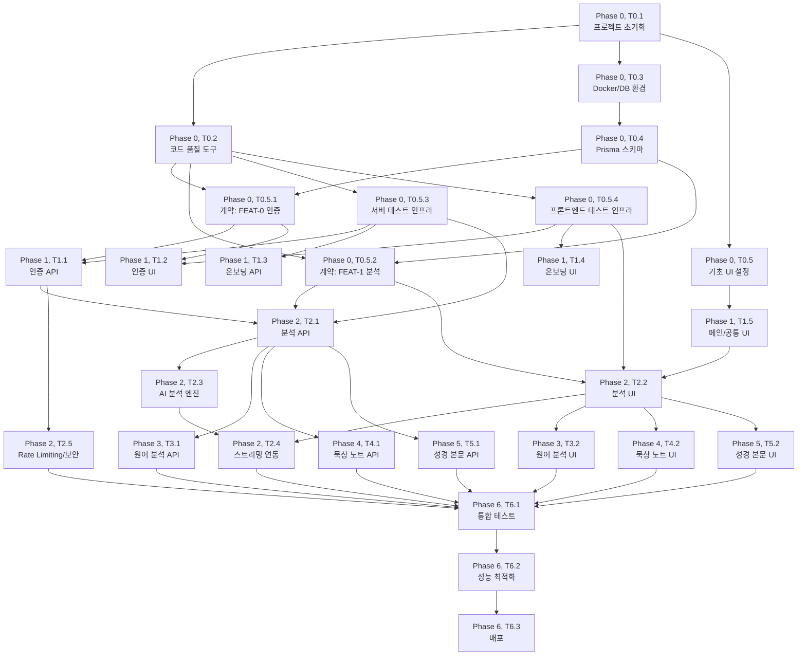

# TASKS: beeSvat

> 성경 본문을 구문 분석하여 주동사를 파싱하고 해석하는 AI 프로그램
> 기술 스택: Next.js Full-Stack + PostgreSQL (데이터베이스)

---

## MVP 캡슐

| #   | 항목               | 내용                                                                         |
| --- | ------------------ | ---------------------------------------------------------------------------- |
| 1   | 목표               | 성경 본문의 구문 구조를 자동 분석하여 초보자도 깊은 묵상을 할 수 있게 돕는다 |
| 2   | 페르소나           | 일반 신자/성경 묵상자                                                        |
| 3   | 핵심 기능 (FEAT-1) | 성경 구문 분석 (주동사/수식어 자동 파싱 & 해설)                              |
| 4   | 성공 지표          | 주간 활성 사용자 수                                                          |
| 5   | 입력 지표          | 사용자 만족도 4.5점 이상                                                     |
| 6   | 비기능 요구        | 모바일 3초 이내 로딩, 반응형 웹앱                                            |
| 7   | Out-of-scope       | 원어 사전 기능, 소셜 기능, 결제 시스템                                       |
| 8   | Top 리스크         | 구문 분석 AI의 정확도                                                        |
| 9   | 완화/실험          | 개혁신학 관점 검증자 리뷰 프로세스                                           |
| 10  | 다음 단계          | TASKS.md 기반 개발 시작                                                      |

---

## 마일스톤 개요 테이블

| 마일스톤 | Phase   | 설명                                              | 예상 일수 |
| -------- | ------- | ------------------------------------------------- | --------- |
| M0       | Phase 0 | 프로젝트 셋업 (Next.js Full-Stack, Docker, CI/CD) | 2일       |
| M0.5     | Phase 0 | 계약 & 테스트 설계 (Contract-First)               | 2일       |
| M1       | Phase 1 | FEAT-0 공통 흐름 (온보딩/로그인)                  | 5일       |
| M2       | Phase 2 | FEAT-1 성경 구문 분석 (MVP 핵심)                  | 7일       |
| M3       | Phase 3 | FEAT-2 원어(히브리어/헬라어) 동사 분석            | 5일       |
| M4       | Phase 4 | FEAT-3 묵상 노트 자동 생성                        | 4일       |
| M5       | Phase 5 | FEAT-4 성경 본문 자동 가져오기                    | 3일       |
| M6       | Phase 6 | 통합 테스트 & 배포                                | 3일       |

---

## 병렬 실행 가능 태스크 테이블

| 태스크                               | 병렬 가능 | 의존성                          |
| ------------------------------------ | --------- | ------------------------------- |
| T0.1 ~ T0.5                          | 순차      | 없음 (초기 셋업)                |
| T0.5.1 ~ T0.5.4                      | 병렬 가능 | M0 완료                         |
| T1.1 (API 인증) / T1.2 (UI 인증)     | 병렬 가능 | M0.5 완료 (계약 기반 독립 개발) |
| T1.3 (API 온보딩) / T1.4 (UI 온보딩) | 병렬 가능 | M0.5 완료                       |
| T2.1 (API 분석) / T2.2 (UI 분석)     | 병렬 가능 | M0.5 완료 (계약 기반 독립 개발) |
| T2.3 (AI 서비스)                     | 단독      | T2.1 완료                       |
| T2.4 (UI 스트리밍)                   | 단독      | T2.2 + T2.3 완료                |
| T3.1 (API) / T3.2 (UI)               | 병렬 가능 | M2 완료                         |
| T4.1 (API) / T4.2 (UI)               | 병렬 가능 | M2 완료                         |
| T5.1 (API) / T5.2 (UI)               | 병렬 가능 | M2 완료                         |
| T6.1 ~ T6.3                          | 순차      | M1 ~ M5 완료                    |

---

## M0: 프로젝트 셋업 (Phase 0)

### [] Phase 0, T0.1: 프로젝트 초기화 및 디렉토리 구조 생성

**담당**: frontend-specialist + backend-specialist
**작업 내용**:

- Next.js 14+ App Router Full-Stack 프로젝트 초기화 (단일 프로젝트)
- `07-coding-convention.md` 섹션 2.1 디렉토리 구조 기준으로 폴더 생성
- `src/app/` (Next.js App Router 페이지 및 API Route Handlers)
- `src/server/` (서버 전용 비즈니스 로직: services, schemas, middleware, config, prompts)
- contracts/ 디렉토리 생성
- docs/planning/ 기획 문서 배치 확인

**산출물**:

- `package.json` (루트, 단일 프로젝트)
- `next.config.ts`
- `tsconfig.json`
- `contracts/` 디렉토리

**완료 조건**:

- [ ] `npm install` 루트에서 성공
- [ ] `npm run dev` Next.js dev 서버 기동 및 기본 페이지 표시

---

### [] Phase 0, T0.2: TypeScript 및 코드 품질 도구 설정

**담당**: backend-specialist
**작업 내용**:

- `07-coding-convention.md` 섹션 8 기준으로 설정
- TypeScript strict 모드 설정 (단일 tsconfig.json)
- ESLint flat config 설정 (루트 레벨 공통 규칙)
- Prettier 설정 (.prettierrc)
- Husky + lint-staged 설정 (pre-commit 훅)

**산출물**:

- `tsconfig.json` (루트)
- `eslint.config.js` (루트)
- `.prettierrc`
- `.husky/pre-commit`

**완료 조건**:

- [ ] `npx tsc --noEmit` 통과
- [ ] `npm run lint` 통과
- [ ] pre-commit 훅 동작 확인

---

### [] Phase 0, T0.3: Docker 및 로컬 개발 환경 설정

**담당**: backend-specialist
**작업 내용**:

- Docker Compose 설정 (PostgreSQL 15+, 개발용 DB)
- `.env.example` 생성 (`07-coding-convention.md` 섹션 5.3 참조)
- `.gitignore` 설정 (`07-coding-convention.md` 섹션 5.4 참조)
- Prisma 초기화 및 DB 연결 설정

**산출물**:

- `docker-compose.yml` (PostgreSQL 서비스)
- `.env.example`
- `.gitignore`
- `prisma/schema.prisma` (초기 설정)

**완료 조건**:

- [ ] `docker compose up -d` PostgreSQL 기동
- [ ] Prisma DB 연결 확인 (`npx prisma db push`)
- [ ] `.env.example` 모든 필수 변수 포함

---

### [] Phase 0, T0.4: Prisma 스키마 및 마이그레이션 설정

**담당**: database-specialist
**작업 내용**:

- `04-database-design.md` 기준으로 Prisma 스키마 작성
- MVP 필수 테이블: User, AuthToken, Analysis, AnalysisResult
- v2 테이블 스키마 주석 처리 (VerbAnalysis, Meditation, BiblePassage, DailyQt, Review)
- 초기 마이그레이션 생성
- 시드 데이터 작성 (테스트용 사용자, 샘플 분석 데이터)

**산출물**:

- `prisma/schema.prisma` (전체 스키마)
- `prisma/migrations/` (초기 마이그레이션)
- `prisma/seed.ts`

**완료 조건**:

- [ ] `npx prisma migrate dev` 성공
- [ ] `npx prisma db seed` 성공
- [ ] `04-database-design.md`의 ERD와 스키마 일치 확인
- [ ] 모든 인덱스 생성 확인

---

### [] Phase 0, T0.5: 프론트엔드 기초 UI 설정

**담당**: frontend-specialist
**작업 내용**:

- `05-design-system.md` 기준으로 기초 디자인 토큰 설정
- Tailwind CSS 설정 (커스텀 컬러, 타이포그래피, 간격 토큰)
- 전역 폰트 설정 (Pretendard, Noto Serif KR)
- 기본 레이아웃 컴포넌트 (Header, Footer, MainLayout)
- CSS 변수 기반 컬러 시스템 (다크 모드 확장 대비)

**산출물**:

- `tailwind.config.ts` (커스텀 토큰)
- `src/styles/globals.css` (CSS 변수, 폰트)
- `src/components/layout/MainLayout.tsx`
- `src/components/layout/Header.tsx`
- `src/components/layout/BottomNav.tsx` (모바일 하단 네비게이션)

**완료 조건**:

- [ ] 디자인 토큰 (컬러, 간격, 타이포그래피) 적용 확인
- [ ] 반응형 레이아웃 동작 확인 (Mobile / Tablet / Desktop)
- [ ] 폰트 로딩 정상 확인

---

## M0.5: 계약 & 테스트 설계 (Phase 0)

### [] Phase 0, T0.5.1: API 계약 파일 작성 (FEAT-0 인증)

**담당**: backend-specialist
**작업 내용**:

- `02-trd.md` 섹션 7.4 계약 파일 구조, 섹션 8.2 API 엔드포인트 기준
- `contracts/types.ts` 공통 타입 정의 (ApiResponse, ApiError, PaginationMeta)
- `contracts/auth.contract.ts` 인증 API 계약 정의
  - POST /api/v1/auth/register: 요청/응답 타입, Zod 스키마
  - POST /api/v1/auth/login: 요청/응답 타입, Zod 스키마
  - POST /api/v1/auth/refresh: 요청/응답 타입, Zod 스키마
  - POST /api/v1/auth/logout: 요청/응답 타입
  - GET /api/v1/auth/me: 응답 타입

**산출물**:

- `contracts/types.ts`
- `contracts/auth.contract.ts`

**완료 조건**:

- [ ] 모든 API 엔드포인트의 요청/응답 타입 정의 완료
- [ ] Zod 스키마로 검증 가능
- [ ] TypeScript 컴파일 통과

---

### [] Phase 0, T0.5.2: API 계약 파일 작성 (FEAT-1 구문 분석)

**담당**: backend-specialist
**작업 내용**:

- `contracts/analysis.contract.ts` 구문 분석 API 계약 정의
  - POST /api/v1/analysis: 분석 요청 (book, chapter, verseStart, verseEnd, passageText)
  - GET /api/v1/analysis/{id}: 분석 결과 조회
  - GET /api/v1/analysis: 분석 이력 목록 (페이지네이션)
  - PATCH /api/v1/analysis/{id}/rating: 만족도 평가
- 구문 분석 결과 타입 정의 (AnalysisResult, MainVerb, Modifier, Connector)
- `04-database-design.md` 섹션 2.3 ANALYSIS_RESULT JSONB 구조 반영

**산출물**:

- `contracts/analysis.contract.ts`

**완료 조건**:

- [ ] 분석 요청/결과의 모든 필드 타입 정의 완료
- [ ] JSONB 구조 (structure, mainVerbs, modifiers, connectors) 타입 정의
- [ ] TypeScript 컴파일 통과

---

### [] Phase 0, T0.5.3: 서버 테스트 인프라 설정

**담당**: test-specialist
**작업 내용**:

- Vitest 설정 (TypeScript, 경로 매핑, 통합 테스트 러너)
- Next.js Route Handler 테스트 유틸리티 설정 (API 통합 테스트용)
- Prisma Client Mock 설정 (단위 테스트용 DB 모킹)
- 테스트 유틸리티 함수 작성 (테스트 사용자 생성, JWT 토큰 생성)
- 테스트 디렉토리 구조 생성

**산출물**:

- `vitest.config.ts` (루트, 통합 설정)
- `src/__tests__/setup.ts` (테스트 환경 설정)
- `src/__tests__/utils/testHelpers.ts` (테스트 유틸리티)
- `src/__tests__/utils/prismaMock.ts` (Prisma 모킹)

**완료 조건**:

- [ ] `npx vitest --passWithNoTests` 성공
- [ ] Prisma Mock 동작 확인
- [ ] 테스트 유틸리티 함수 동작 확인

---

### [] Phase 0, T0.5.4: 프론트엔드 테스트 인프라 설정

**담당**: test-specialist
**작업 내용**:

- Vitest 설정 (React Testing Library 통합, T0.5.3의 통합 설정 활용)
- MSW(Mock Service Worker) 설정
- 계약 기반 Mock 핸들러 생성 준비 (`src/mocks/handlers/`)
- Mock 데이터 디렉토리 구조 생성 (`src/mocks/data/`)
- Playwright 설정 (E2E 테스트)

**산출물**:

- `vitest.config.ts` (T0.5.3에서 생성한 통합 설정에 프론트엔드 설정 추가)
- `src/mocks/server.ts` (MSW 서버 설정)
- `src/mocks/handlers/index.ts`
- `playwright.config.ts` (루트)

**완료 조건**:

- [ ] `npx vitest --passWithNoTests` 성공
- [ ] MSW 서버 기동 확인
- [ ] Playwright 설치 및 기본 실행 확인

---

## M1: FEAT-0 공통 흐름 (Phase 1)

### [] Phase 1, T1.1: 회원가입/로그인 API RED->GREEN

**담당**: backend-specialist
**Git Worktree 설정**:

```bash
git worktree add ../beeSvat-auth -b feature/feat-0-auth
cd ../beeSvat-auth
```

**TDD 사이클**:

1. RED: 테스트 작성 (실패 확인)
   - `src/__tests__/server/unit/services/auth.service.test.ts`
     - 회원가입: 이메일 중복 검사, 비밀번호 해싱, 사용자 생성
     - 로그인: 이메일/비밀번호 검증, JWT 발급, Refresh Token 저장
     - 토큰 갱신: Refresh Token 검증, 새 Access Token 발급
     - 로그아웃: Refresh Token 삭제
   - `src/__tests__/server/integration/routes/auth.route.test.ts`
     - POST /api/v1/auth/register: 성공/실패 케이스
     - POST /api/v1/auth/login: 성공/실패 케이스
     - POST /api/v1/auth/refresh: 성공/만료 케이스
     - POST /api/v1/auth/logout: 성공 케이스
     - GET /api/v1/auth/me: 인증됨/미인증 케이스
   ```bash
   npx vitest auth --reporter=verbose
   # 모든 테스트 FAIL 확인
   ```
2. GREEN: 최소 구현 (테스트 통과)
   - `src/server/services/auth.service.ts` (비즈니스 로직)
   - `src/app/api/v1/auth/` (Route Handlers)
   - `src/server/schemas/auth.schema.ts` (Zod 검증, 계약과 동기화)
   - `src/server/middleware/auth.middleware.ts` (JWT 인증 미들웨어)
   - `src/server/config/jwt.config.ts` (JWT 설정)
   ```bash
   npx vitest auth --reporter=verbose
   # 모든 테스트 PASS 확인
   ```
3. REFACTOR: 리팩토링
   - 에러 핸들링 통일 (TRD 섹션 8.3 에러 응답 형식)
   - 코드 정리 및 린트 통과

**산출물**:

- `src/server/services/auth.service.ts`
- `src/app/api/v1/auth/` (Route Handlers)
- `src/server/schemas/auth.schema.ts`
- `src/server/middleware/auth.middleware.ts`
- `src/__tests__/server/unit/services/auth.service.test.ts`
- `src/__tests__/server/integration/routes/auth.route.test.ts`

**인수 조건**:

- [ ] 회원가입 시 이메일 중복 검사 동작
- [ ] 비밀번호 bcrypt 해싱 (cost factor 12)
- [ ] JWT Access Token (15분) + Refresh Token (7일) 발급
- [ ] Zod 스키마 기반 입력 검증
- [ ] `contracts/auth.contract.ts` 계약과 응답 형식 일치
- [ ] 테스트 커버리지 >= 80%
- [ ] `npx vitest auth --coverage` 통과
- [ ] `npx tsc --noEmit` 통과

**완료 시**: 사용자 승인 후 main 병합

---

### [] Phase 1, T1.2: 로그인/회원가입 UI RED->GREEN

**담당**: frontend-specialist
**Git Worktree 설정**:

```bash
git worktree add ../beeSvat-auth -b feature/feat-0-auth
cd ../beeSvat-auth
```

**TDD 사이클**:

1. RED: 테스트 작성 (실패 확인)
   - `src/__tests__/components/auth/LoginForm.test.tsx`
     - 이메일/비밀번호 입력 필드 렌더링
     - 폼 검증 (빈 필드, 이메일 형식)
     - 로그인 API 호출 (MSW Mock)
     - 성공 시 메인 페이지 리다이렉트
     - 실패 시 에러 메시지 표시
   - `src/__tests__/components/auth/RegisterForm.test.tsx`
     - 이메일/비밀번호/닉네임 입력 필드 렌더링
     - 폼 검증
     - 회원가입 API 호출 (MSW Mock)
   ```bash
   npx vitest auth --reporter=verbose
   # 모든 테스트 FAIL 확인
   ```
2. GREEN: 최소 구현 (테스트 통과)
   - `src/app/(auth)/login/page.tsx` (로그인 페이지)
   - `src/app/(auth)/register/page.tsx` (회원가입 페이지)
   - `src/components/auth/LoginForm.tsx`
   - `src/components/auth/RegisterForm.tsx`
   - `src/services/authService.ts` (API 호출)
   - `src/stores/authStore.ts` (Zustand 인증 상태)
   - `src/mocks/handlers/auth.ts` (MSW Mock 핸들러)
   - `src/mocks/data/auth.ts` (Mock 데이터)
   ```bash
   npx vitest auth --reporter=verbose
   # 모든 테스트 PASS 확인
   ```
3. REFACTOR: 리팩토링
   - React Hook Form + Zod 폼 검증 적용
   - `05-design-system.md` 디자인 토큰 적용 (버튼, 입력 필드 스타일)

**산출물**:

- `src/app/(auth)/login/page.tsx`
- `src/app/(auth)/register/page.tsx`
- `src/components/auth/LoginForm.tsx`
- `src/components/auth/RegisterForm.tsx`
- `src/services/authService.ts`
- `src/stores/authStore.ts`
- `src/mocks/handlers/auth.ts`
- `src/__tests__/components/auth/LoginForm.test.tsx`
- `src/__tests__/components/auth/RegisterForm.test.tsx`

**인수 조건**:

- [ ] 로그인/회원가입 폼 렌더링 정상
- [ ] 폼 검증 동작 (빈 필드, 이메일 형식, 비밀번호 최소 길이)
- [ ] MSW Mock으로 API 연동 테스트 통과
- [ ] 반응형 디자인 (모바일 < 640px, 데스크톱 > 1024px)
- [ ] 접근성: 포커스 링, 클릭 영역 44x44px, 에러 텍스트 메시지
- [ ] `npx vitest auth --coverage` 통과
- [ ] `npx tsc --noEmit` 통과

**완료 시**: 사용자 승인 후 main 병합

---

### [] Phase 1, T1.3: 온보딩 튜토리얼 API RED->GREEN

**담당**: backend-specialist
**Git Worktree 설정**:

```bash
git worktree add ../beeSvat-onboarding -b feature/feat-0-onboarding
cd ../beeSvat-onboarding
```

**TDD 사이클**:

1. RED: 테스트 작성 (실패 확인)
   - `src/__tests__/server/unit/services/user.service.test.ts`
     - 사용자 온보딩 완료 상태 업데이트
     - 사용자 프로필 조회
   ```bash
   npx vitest user --reporter=verbose
   ```
2. GREEN: 최소 구현 (테스트 통과)
   - `src/server/services/user.service.ts`
   - `src/app/api/v1/users/` (Route Handlers)
3. REFACTOR: 리팩토링

**산출물**:

- `src/server/services/user.service.ts`
- `src/app/api/v1/users/` (Route Handlers)
- `src/__tests__/server/unit/services/user.service.test.ts`

**인수 조건**:

- [ ] 온보딩 완료 상태 저장/조회 동작
- [ ] `npx vitest user --coverage` 통과

**완료 시**: 사용자 승인 후 main 병합

---

### [] Phase 1, T1.4: 온보딩 튜토리얼 UI RED->GREEN

**담당**: frontend-specialist
**Git Worktree 설정**:

```bash
git worktree add ../beeSvat-onboarding -b feature/feat-0-onboarding
cd ../beeSvat-onboarding
```

**TDD 사이클**:

1. RED: 테스트 작성 (실패 확인)
   - `src/__tests__/components/onboarding/OnboardingFlow.test.tsx`
     - 3단계 온보딩 렌더링 (구문 분석이란? -> 사용법 안내 -> 샘플 분석 체험)
     - 단계 전환 동작
     - 스킵 기능
     - 완료 시 메인 페이지 이동
   ```bash
   npx vitest onboarding --reporter=verbose
   ```
2. GREEN: 최소 구현 (테스트 통과)
   - `src/app/(auth)/onboarding/page.tsx`
   - `src/components/onboarding/OnboardingFlow.tsx`
   - `src/components/onboarding/OnboardingStep.tsx`
   - `src/components/onboarding/SampleAnalysis.tsx` (샘플 구문 분석 체험)
3. REFACTOR: 리팩토링
   - 애니메이션 적용 (페이드 인, 200ms)
   - `05-design-system.md` 디자인 토큰 적용

**산출물**:

- `src/app/(auth)/onboarding/page.tsx`
- `src/components/onboarding/OnboardingFlow.tsx`
- `src/components/onboarding/OnboardingStep.tsx`
- `src/components/onboarding/SampleAnalysis.tsx`
- `src/__tests__/components/onboarding/OnboardingFlow.test.tsx`

**인수 조건**:

- [ ] 3단계 온보딩 플로우 정상 동작
- [ ] 샘플 분석 체험 (하드코딩된 예시 데이터)
- [ ] 스킵 기능 동작
- [ ] 반응형 디자인
- [ ] `npx vitest onboarding --coverage` 통과

**완료 시**: 사용자 승인 후 main 병합

---

### [] Phase 1, T1.5: 메인 화면 및 공통 UI 컴포넌트 RED->GREEN

**담당**: frontend-specialist
**Git Worktree 설정**:

```bash
git worktree add ../beeSvat-main-ui -b feature/feat-0-main-ui
cd ../beeSvat-main-ui
```

**TDD 사이클**:

1. RED: 테스트 작성 (실패 확인)
   - `src/__tests__/components/ui/Button.test.tsx` (버튼 컴포넌트)
   - `src/__tests__/components/ui/Input.test.tsx` (입력 필드)
   - `src/__tests__/components/ui/Card.test.tsx` (카드)
   - `src/__tests__/app/MainPage.test.tsx` (메인 페이지)
   ```bash
   npx vitest ui --reporter=verbose
   ```
2. GREEN: 최소 구현 (테스트 통과)
   - `src/components/ui/Button.tsx` (`05-design-system.md` 섹션 5.1)
   - `src/components/ui/Input.tsx` (`05-design-system.md` 섹션 5.2)
   - `src/components/ui/Card.tsx` (`05-design-system.md` 섹션 5.3)
   - `src/components/ui/StarRating.tsx` (`05-design-system.md` 섹션 5.5)
   - `src/app/page.tsx` (메인 페이지: 구절 입력 영역)
3. REFACTOR: 리팩토링
   - 접근성 적용 (포커스 링, aria-label, 색상 대비)
   - Storybook 또는 컴포넌트 문서화 (선택)

**산출물**:

- `src/components/ui/Button.tsx`
- `src/components/ui/Input.tsx`
- `src/components/ui/Card.tsx`
- `src/components/ui/StarRating.tsx`
- `src/app/page.tsx`
- 관련 테스트 파일

**인수 조건**:

- [ ] 버튼: Primary/Secondary/Ghost 3종 + Large/Medium/Small 3크기
- [ ] 입력: 기본/포커스/에러/비활성 4상태
- [ ] 카드: Surface 배경, 호버 그림자 효과
- [ ] 별점: 1~5점 선택 동작, Accent 색상
- [ ] 메인 페이지: 구절 입력 영역 렌더링
- [ ] 접근성: WCAG AA 색상 대비, 포커스 링 2px, 클릭 영역 >= 44x44px
- [ ] `npx vitest ui --coverage` 통과

**완료 시**: 사용자 승인 후 main 병합

---

## M2: FEAT-1 성경 구문 분석 - MVP 핵심 (Phase 2)

### [] Phase 2, T2.1: 구문 분석 API (CRUD) RED->GREEN

**담당**: backend-specialist
**Git Worktree 설정**:

```bash
git worktree add ../beeSvat-analysis -b feature/feat-1-analysis
cd ../beeSvat-analysis
```

**TDD 사이클**:

1. RED: 테스트 작성 (실패 확인)
   - `src/__tests__/server/unit/services/analysis.service.test.ts`
     - 분석 요청 생성 (status: pending)
     - 분석 결과 조회 (by id)
     - 분석 이력 목록 (페이지네이션, 사용자별 필터링)
     - 만족도 평가 업데이트
     - 인증되지 않은 사용자 접근 차단
   - `src/__tests__/server/integration/routes/analysis.route.test.ts`
     - POST /api/v1/analysis: 성공/검증 실패 케이스
     - GET /api/v1/analysis/{id}: 성공/권한 없음/없는 ID 케이스
     - GET /api/v1/analysis: 페이지네이션 동작
     - PATCH /api/v1/analysis/{id}/rating: 평점 업데이트
   ```bash
   npx vitest analysis --reporter=verbose
   # 모든 테스트 FAIL 확인
   ```
2. GREEN: 최소 구현 (테스트 통과)
   - `src/server/services/analysis.service.ts`
   - `src/app/api/v1/analysis/` (Route Handlers)
   - `src/server/schemas/analysis.schema.ts` (Zod, 계약과 동기화)
   ```bash
   npx vitest analysis --reporter=verbose
   # 모든 테스트 PASS 확인
   ```
3. REFACTOR: 리팩토링
   - 에러 응답 형식 통일
   - 페이지네이션 유틸리티 추출

**산출물**:

- `src/server/services/analysis.service.ts`
- `src/app/api/v1/analysis/` (Route Handlers)
- `src/server/schemas/analysis.schema.ts`
- `src/__tests__/server/unit/services/analysis.service.test.ts`
- `src/__tests__/server/integration/routes/analysis.route.test.ts`

**인수 조건**:

- [ ] POST /api/v1/analysis: 분석 요청 생성 (status: pending)
- [ ] GET /api/v1/analysis/{id}: 분석 결과 조회 (본인 데이터만)
- [ ] GET /api/v1/analysis: 이력 목록 (페이지네이션)
- [ ] PATCH /api/v1/analysis/{id}/rating: 만족도 평가 (1~5)
- [ ] Zod 스키마 검증 동작 (성경 구절 형식 등)
- [ ] JWT 인증 필수
- [ ] `contracts/analysis.contract.ts` 계약과 응답 형식 일치
- [ ] 테스트 커버리지 >= 80%
- [ ] `npx vitest analysis --coverage` 통과

**완료 시**: 사용자 승인 후 main 병합

---

### [] Phase 2, T2.2: 구문 분석 결과 UI RED->GREEN

**담당**: frontend-specialist
**Git Worktree 설정**:

```bash
git worktree add ../beeSvat-analysis -b feature/feat-1-analysis
cd ../beeSvat-analysis
```

**TDD 사이클**:

1. RED: 테스트 작성 (실패 확인)
   - `src/__tests__/components/analysis/BiblePassageInput.test.tsx`
     - 책/장/절 선택 UI 렌더링
     - 자유 입력 (예: "요한복음 3:16") 파싱
   - `src/__tests__/components/analysis/AnalysisResult.test.tsx`
     - 주동사 강조 표시 (Primary 색상 배경 + 밑줄)
     - 수식어 표시 (Secondary 색상 배경)
     - 접속사 표시 (Accent 색상 배경)
     - 쉬운 해설 패널 렌더링
     - 범례 표시
   - `src/__tests__/components/analysis/StarRatingFeedback.test.tsx`
     - 별점 선택/제출 동작
   ```bash
   npx vitest analysis --reporter=verbose
   # 모든 테스트 FAIL 확인
   ```
2. GREEN: 최소 구현 (테스트 통과)
   - `src/app/analysis/page.tsx` (구문 분석 페이지)
   - `src/components/analysis/BiblePassageInput.tsx`
   - `src/components/analysis/AnalysisResult.tsx` (`05-design-system.md` 섹션 5.4)
   - `src/components/analysis/VerbHighlight.tsx` (주동사 강조)
   - `src/components/analysis/ModifierHighlight.tsx` (수식어 표시)
   - `src/components/analysis/ExplanationPanel.tsx` (해설 패널)
   - `src/components/analysis/SyntaxLegend.tsx` (범례)
   - `src/components/analysis/StarRatingFeedback.tsx` (만족도 평가)
   - `src/services/analysisService.ts` (API 호출)
   - `src/stores/analysisStore.ts` (Zustand 분석 상태)
   - `src/mocks/handlers/analysis.ts` (MSW Mock 핸들러)
   - `src/mocks/data/analysis.ts` (Mock 분석 결과 데이터)
   ```bash
   npx vitest analysis --reporter=verbose
   # 모든 테스트 PASS 확인
   ```
3. REFACTOR: 리팩토링
   - 구문 분석 결과 순차 하이라이트 애니메이션 (각 300ms)
   - 디자인 토큰 정밀 적용

**산출물**:

- `src/app/analysis/page.tsx`
- `src/components/analysis/BiblePassageInput.tsx`
- `src/components/analysis/AnalysisResult.tsx`
- `src/components/analysis/VerbHighlight.tsx`
- `src/components/analysis/ModifierHighlight.tsx`
- `src/components/analysis/ExplanationPanel.tsx`
- `src/components/analysis/SyntaxLegend.tsx`
- `src/components/analysis/StarRatingFeedback.tsx`
- `src/services/analysisService.ts`
- `src/stores/analysisStore.ts`
- `src/mocks/handlers/analysis.ts`
- 관련 테스트 파일

**인수 조건**:

- [ ] 성경 구절 입력 UI 동작 (책/장/절 선택 또는 자유 입력)
- [ ] 구문 분석 결과: 주동사(남색), 수식어(올리브그린), 접속사(골드) 색상 구분
- [ ] 색상 + 밑줄/굵기 병행 (색각 이상 대응)
- [ ] 쉬운 해설 패널 렌더링
- [ ] 범례 하단 표시
- [ ] 별점 만족도 평가 동작
- [ ] 반응형: 모바일(본문 아래 결과), 데스크톱(좌우 2패널)
- [ ] MSW Mock으로 전체 플로우 테스트 통과
- [ ] `npx vitest analysis --coverage` 통과

**완료 시**: 사용자 승인 후 main 병합

---

### [] Phase 2, T2.3: AI 구문 분석 엔진 서비스 RED->GREEN

**담당**: backend-specialist
**Git Worktree 설정**:

```bash
git worktree add ../beeSvat-ai-service -b feature/feat-1-ai-service
cd ../beeSvat-ai-service
```

**TDD 사이클**:

1. RED: 테스트 작성 (실패 확인)
   - `src/__tests__/server/unit/services/ai.service.test.ts`
     - 프롬프트 생성 함수 테스트 (입력 구절 -> 프롬프트 문자열)
     - AI 응답 파싱 테스트 (JSON 파싱 -> AnalysisResult 타입 변환)
     - AI 응답 검증 테스트 (Zod 스키마 검증)
     - 에러 처리 테스트 (AI API 타임아웃, 잘못된 응답 형식)
   - `src/__tests__/server/unit/prompts/analysis.prompt.test.ts`
     - 프롬프트 템플릿 포맷 검증
     - 개혁신학 관점 지시 포함 확인
   ```bash
   npx vitest ai --reporter=verbose
   # 모든 테스트 FAIL 확인
   ```
2. GREEN: 최소 구현 (테스트 통과)
   - `src/server/services/ai.service.ts` (AI API 호출, 응답 파싱)
   - `src/server/prompts/analysis-v1.prompt.ts` (구문 분석 프롬프트 템플릿)
   - `src/server/services/analysis.service.ts` 업데이트 (AI 서비스 연동)
   - `src/server/config/ai.config.ts` (AI API 설정)
   ```bash
   npx vitest ai --reporter=verbose
   # 모든 테스트 PASS 확인
   ```
3. REFACTOR: 리팩토링
   - 프롬프트 템플릿 최적화
   - AI 응답 파싱 견고성 강화

**산출물**:

- `src/server/services/ai.service.ts`
- `src/server/prompts/analysis-v1.prompt.ts`
- `src/server/config/ai.config.ts`
- `src/__tests__/server/unit/services/ai.service.test.ts`
- `src/__tests__/server/unit/prompts/analysis.prompt.test.ts`

**인수 조건**:

- [ ] 프롬프트에 개혁신학 관점 명시
- [ ] AI 응답을 AnalysisResult 타입으로 정확히 파싱
- [ ] mainVerbs, modifiers, connectors 배열 추출
- [ ] explanation (쉬운 해설) 생성
- [ ] AI API 타임아웃 처리 (5초 이내)
- [ ] Zod 스키마로 AI 응답 검증
- [ ] `npx vitest ai --coverage` 통과

**완료 시**: 사용자 승인 후 main 병합

---

### [] Phase 2, T2.4: AI 분석 스트리밍 연동 RED->GREEN

**담당**: backend-specialist + frontend-specialist
**Git Worktree 설정**:

```bash
git worktree add ../beeSvat-streaming -b feature/feat-1-streaming
cd ../beeSvat-streaming
```

**TDD 사이클**:

1. RED: 테스트 작성 (실패 확인)
   - `src/__tests__/server/integration/routes/analysis.streaming.test.ts`
     - SSE(Server-Sent Events) 스트리밍 응답 테스트
     - 분석 진행 상태 전송 (processing -> completed)
   - `src/__tests__/hooks/useAnalysisStream.test.ts`
     - 스트리밍 데이터 수신 훅 테스트
     - 로딩 상태 관리
     - 에러 처리
   ```bash
   npx vitest streaming --reporter=verbose
   npx vitest stream --reporter=verbose
   ```
2. GREEN: 최소 구현 (테스트 통과)
   - `src/app/api/v1/analysis/` 업데이트 (SSE Route Handler)
   - `src/hooks/useAnalysisStream.ts` (스트리밍 훅)
   - `src/components/analysis/StreamingLoader.tsx` (스트리밍 로딩 UI)
3. REFACTOR: 리팩토링
   - 스켈레톤 UI 로딩 상태
   - 타이핑 효과 애니메이션 (해설 텍스트)

**산출물**:

- `src/app/api/v1/analysis/` (업데이트)
- `src/hooks/useAnalysisStream.ts`
- `src/components/analysis/StreamingLoader.tsx`
- 관련 테스트 파일

**인수 조건**:

- [ ] SSE 스트리밍으로 분석 진행 상태 실시간 전송
- [ ] 첫 토큰 응답 < 2초 (TRD 섹션 3.1)
- [ ] 스켈레톤 UI 로딩 표시
- [ ] 해설 텍스트 타이핑 효과
- [ ] 네트워크 에러 시 재시도 안내
- [ ] `npx vitest streaming` 통과
- [ ] `npx vitest stream` 통과

**완료 시**: 사용자 승인 후 main 병합

---

### [] Phase 2, T2.5: Rate Limiting 및 보안 강화 RED->GREEN

**담당**: backend-specialist
**Git Worktree 설정**:

```bash
git worktree add ../beeSvat-security -b feature/feat-1-security
cd ../beeSvat-security
```

**TDD 사이클**:

1. RED: 테스트 작성 (실패 확인)
   - `src/__tests__/server/unit/middleware/rateLimiter.test.ts`
     - AI 분석 API: 분당 10회/사용자 제한
     - 제한 초과 시 429 응답
   - `src/__tests__/server/unit/middleware/inputSanitizer.test.ts`
     - XSS 방지 입력 필터링
     - AI 프롬프트 인젝션 방지
   ```bash
   npx vitest middleware --reporter=verbose
   ```
2. GREEN: 최소 구현 (테스트 통과)
   - `src/server/middleware/rateLimiter.ts`
   - `src/server/middleware/inputSanitizer.ts`
   - `src/middleware.ts` (Next.js Middleware - CORS 등)
3. REFACTOR: 리팩토링

**산출물**:

- `src/server/middleware/rateLimiter.ts`
- `src/server/middleware/inputSanitizer.ts`
- `src/middleware.ts`
- 관련 테스트 파일

**인수 조건**:

- [ ] AI 분석 API: 분당 10회/사용자 Rate Limiting
- [ ] 제한 초과 시 429 Too Many Requests 응답
- [ ] XSS 방지 입력 필터링 동작
- [ ] AI 프롬프트 인젝션 방지 (사용자 입력 필터링)
- [ ] CORS 허용된 도메인만 접근
- [ ] `npx vitest middleware --coverage` 통과

**완료 시**: 사용자 승인 후 main 병합

---

## M3: FEAT-2 원어(히브리어/헬라어) 동사 분석 (Phase 3)

### [] Phase 3, T3.1: 원어 동사 분석 API RED->GREEN

**담당**: backend-specialist
**Git Worktree 설정**:

```bash
git worktree add ../beeSvat-verb -b feature/feat-2-verb
cd ../beeSvat-verb
```

**TDD 사이클**:

1. RED: 테스트 작성 (실패 확인)
   - `src/__tests__/server/unit/services/verb.service.test.ts`
     - 원어 동사 상세 분석 조회 (시제/태/법/인칭/수, 빈얀)
     - 동일 원어 사용 구절 참조 검색
     - 히브리어/헬라어 구분 처리
   - `src/__tests__/server/integration/routes/verb.route.test.ts`
     - GET /api/v1/verbs/{word}: 동사 상세 분석
     - GET /api/v1/verbs/{word}/references: 참조 구절 목록
   ```bash
   npx vitest verb --reporter=verbose
   ```
2. GREEN: 최소 구현 (테스트 통과)
   - `src/server/services/verb.service.ts`
   - `src/app/api/v1/verbs/` (Route Handlers)
   - `src/server/schemas/verb.schema.ts`
   - `contracts/verb.contract.ts` 업데이트
3. REFACTOR: 리팩토링
   - 원어 데이터 UTF-8 인코딩 확인
   - 음역(transliteration) 표기 통일

**산출물**:

- `src/server/services/verb.service.ts`
- `src/app/api/v1/verbs/` (Route Handlers)
- `src/server/schemas/verb.schema.ts`
- `contracts/verb.contract.ts`
- 관련 테스트 파일

**인수 조건**:

- [ ] 원어 동사: 원형, 음역, 시제/태/법/인칭/수 정보 반환
- [ ] 히브리어 빈얀(Qal, Niphal, Piel 등) 정보 반환
- [ ] 동일 원어 참조 구절 목록 반환
- [ ] 히브리어/헬라어 UTF-8 정상 처리
- [ ] `npx vitest verb --coverage` 통과

**완료 시**: 사용자 승인 후 main 병합

---

### [] Phase 3, T3.2: 원어 동사 상세 UI RED->GREEN

**담당**: frontend-specialist
**Git Worktree 설정**:

```bash
git worktree add ../beeSvat-verb -b feature/feat-2-verb
cd ../beeSvat-verb
```

**TDD 사이클**:

1. RED: 테스트 작성 (실패 확인)
   - `src/__tests__/components/analysis/VerbDetailPanel.test.tsx`
     - 원어 동사 클릭 시 상세 패널 열림
     - 원형, 음역, 문법 분석 정보 표시
     - 의미 해설 표시
     - 참조 구절 목록 표시 및 이동
   ```bash
   npx vitest verb --reporter=verbose
   ```
2. GREEN: 최소 구현 (테스트 통과)
   - `src/components/analysis/VerbDetailPanel.tsx`
   - `src/components/analysis/GrammarTable.tsx` (문법 분석 테이블)
   - `src/components/analysis/ReferenceVerses.tsx` (참조 구절)
   - `src/services/verbService.ts`
   - `src/mocks/handlers/verb.ts`
3. REFACTOR: 리팩토링
   - `05-design-system.md` 섹션 2.2 구문 분석 전용 컬러 적용
   - 원어 폰트 (Noto Sans Hebrew / Noto Sans Greek) 적용

**산출물**:

- `src/components/analysis/VerbDetailPanel.tsx`
- `src/components/analysis/GrammarTable.tsx`
- `src/components/analysis/ReferenceVerses.tsx`
- `src/services/verbService.ts`
- `src/mocks/handlers/verb.ts`
- 관련 테스트 파일

**인수 조건**:

- [ ] 분석 결과에서 동사 클릭 시 상세 패널 표시
- [ ] 원어(히브리어/헬라어) 폰트 정상 렌더링
- [ ] 문법 분석: 시제/태/법/인칭/수/빈얀 테이블 표시
- [ ] 음역(transliteration) 병행 표시
- [ ] 문법 용어 영어/한국어 병기 (예: "Aorist(부정과거)")
- [ ] 참조 구절 클릭 시 해당 구절 분석 페이지 이동
- [ ] `npx vitest verb --coverage` 통과

**완료 시**: 사용자 승인 후 main 병합

---

## M4: FEAT-3 묵상 노트 자동 생성 (Phase 4)

### [] Phase 4, T4.1: 묵상 노트 CRUD API RED->GREEN

**담당**: backend-specialist
**Git Worktree 설정**:

```bash
git worktree add ../beeSvat-meditation -b feature/feat-3-meditation
cd ../beeSvat-meditation
```

**TDD 사이클**:

1. RED: 테스트 작성 (실패 확인)
   - `src/__tests__/server/unit/services/meditation.service.test.ts`
     - 묵상 노트 생성 (분석 결과 연결)
     - 묵상 노트 목록 조회 (사용자별, 페이지네이션)
     - 묵상 노트 상세 조회
     - 묵상 노트 수정
     - 묵상 노트 삭제
     - AI 자동 생성 묵상 노트 초안
   - `src/__tests__/server/integration/routes/meditation.route.test.ts`
     - POST /api/v1/meditations: 생성
     - GET /api/v1/meditations: 목록
     - GET /api/v1/meditations/{id}: 상세
     - PUT /api/v1/meditations/{id}: 수정
     - DELETE /api/v1/meditations/{id}: 삭제
     - POST /api/v1/meditations/generate: AI 자동 생성
   ```bash
   npx vitest meditation --reporter=verbose
   ```
2. GREEN: 최소 구현 (테스트 통과)
   - `src/server/services/meditation.service.ts`
   - `src/app/api/v1/meditations/` (Route Handlers)
   - `src/server/schemas/meditation.schema.ts`
   - `src/server/prompts/meditation-v1.prompt.ts` (묵상 노트 생성 프롬프트)
   - `contracts/meditation.contract.ts`
3. REFACTOR: 리팩토링

**산출물**:

- `src/server/services/meditation.service.ts`
- `src/app/api/v1/meditations/` (Route Handlers)
- `src/server/schemas/meditation.schema.ts`
- `src/server/prompts/meditation-v1.prompt.ts`
- `contracts/meditation.contract.ts`
- 관련 테스트 파일

**인수 조건**:

- [ ] CRUD 전체 동작 (생성/조회/수정/삭제)
- [ ] 사용자별 데이터 격리 (본인 노트만 접근)
- [ ] AI 자동 생성: 구문 분석 결과 기반 묵상 노트 초안 생성
- [ ] is_auto_generated 플래그 구분
- [ ] `contracts/meditation.contract.ts` 계약과 응답 형식 일치
- [ ] `npx vitest meditation --coverage` 통과

**완료 시**: 사용자 승인 후 main 병합

---

### [] Phase 4, T4.2: 묵상 노트 UI RED->GREEN

**담당**: frontend-specialist
**Git Worktree 설정**:

```bash
git worktree add ../beeSvat-meditation -b feature/feat-3-meditation
cd ../beeSvat-meditation
```

**TDD 사이클**:

1. RED: 테스트 작성 (실패 확인)
   - `src/__tests__/components/meditation/MeditationEditor.test.tsx`
     - 묵상 노트 작성/편집 UI
     - AI 자동 생성 버튼 동작
     - 저장/취소 동작
   - `src/__tests__/components/meditation/MeditationList.test.tsx`
     - 묵상 노트 목록 렌더링
     - 날짜/구절 정보 표시
   - `src/__tests__/app/MeditationPage.test.tsx`
   ```bash
   npx vitest meditation --reporter=verbose
   ```
2. GREEN: 최소 구현 (테스트 통과)
   - `src/app/meditation/page.tsx` (묵상 노트 목록 페이지)
   - `src/app/meditation/[id]/page.tsx` (묵상 노트 상세/편집)
   - `src/components/meditation/MeditationEditor.tsx`
   - `src/components/meditation/MeditationList.tsx`
   - `src/components/meditation/MeditationCard.tsx`
   - `src/services/meditationService.ts`
   - `src/stores/meditationStore.ts`
   - `src/mocks/handlers/meditation.ts`
3. REFACTOR: 리팩토링
   - 텍스트 에디터 UX 개선 (최소 높이 200px)
   - AI 자동 생성 로딩 상태

**산출물**:

- `src/app/meditation/page.tsx`
- `src/app/meditation/[id]/page.tsx`
- `src/components/meditation/MeditationEditor.tsx`
- `src/components/meditation/MeditationList.tsx`
- `src/components/meditation/MeditationCard.tsx`
- `src/services/meditationService.ts`
- `src/stores/meditationStore.ts`
- `src/mocks/handlers/meditation.ts`
- 관련 테스트 파일

**인수 조건**:

- [ ] 묵상 노트 작성/편집/삭제 전체 플로우 동작
- [ ] AI 자동 생성 버튼: 구문 분석 결과 기반 초안 생성
- [ ] 자동 생성된 노트 편집 가능
- [ ] 묵상 노트 목록: 날짜, 구절 참조, 내용 미리보기
- [ ] 반응형 디자인
- [ ] `npx vitest meditation --coverage` 통과

**완료 시**: 사용자 승인 후 main 병합

---

## M5: FEAT-4 성경 본문 자동 가져오기 (Phase 5)

### [] Phase 5, T5.1: 성경 본문 API RED->GREEN

**담당**: backend-specialist
**Git Worktree 설정**:

```bash
git worktree add ../beeSvat-bible -b feature/feat-4-bible
cd ../beeSvat-bible
```

**TDD 사이클**:

1. RED: 테스트 작성 (실패 확인)
   - `src/__tests__/server/unit/services/bible.service.test.ts`
     - 성경 구절 검색 (책/장/절)
     - 구절 캐시 조회/저장
     - 오늘의 QT 본문 조회 (두란노 연동 Mock)
   - `src/__tests__/server/integration/routes/bible.route.test.ts`
     - GET /api/v1/bible/{book}/{chapter}/{verse}: 특정 구절
     - GET /api/v1/bible/search: 성경 구절 검색
     - GET /api/v1/bible/today: 오늘의 QT 본문
   ```bash
   npx vitest bible --reporter=verbose
   ```
2. GREEN: 최소 구현 (테스트 통과)
   - `src/server/services/bible.service.ts`
   - `src/app/api/v1/bible/` (Route Handlers)
   - `src/server/schemas/bible.schema.ts`
   - `contracts/bible.contract.ts`
3. REFACTOR: 리팩토링
   - 캐시 전략 적용 (BIBLE_PASSAGE 테이블)
   - 두란노 연동 실패 시 직접 입력 폴백

**산출물**:

- `src/server/services/bible.service.ts`
- `src/app/api/v1/bible/` (Route Handlers)
- `src/server/schemas/bible.schema.ts`
- `contracts/bible.contract.ts`
- 관련 테스트 파일

**인수 조건**:

- [ ] 성경 구절 검색 동작
- [ ] 캐시 테이블 조회/저장 동작
- [ ] 오늘의 QT 본문 조회 (Mock 또는 실 연동)
- [ ] 두란노 연동 실패 시 직접 입력 안내 응답
- [ ] `npx vitest bible --coverage` 통과

**완료 시**: 사용자 승인 후 main 병합

---

### [] Phase 5, T5.2: 성경 본문 UI RED->GREEN

**담당**: frontend-specialist
**Git Worktree 설정**:

```bash
git worktree add ../beeSvat-bible -b feature/feat-4-bible
cd ../beeSvat-bible
```

**TDD 사이클**:

1. RED: 테스트 작성 (실패 확인)
   - `src/__tests__/components/bible/BibleViewer.test.tsx`
     - 성경 본문 표시 (Noto Serif KR 폰트)
     - 절 번호 표시 (JetBrains Mono)
     - 구절 선택/하이라이트
   - `src/__tests__/components/bible/TodayQT.test.tsx`
     - 오늘의 QT 본문 자동 로드
     - 연동 실패 시 직접 입력 전환
   ```bash
   npx vitest bible --reporter=verbose
   ```
2. GREEN: 최소 구현 (테스트 통과)
   - `src/components/bible/BibleViewer.tsx`
   - `src/components/bible/VerseNumber.tsx`
   - `src/components/bible/TodayQT.tsx`
   - `src/services/bibleService.ts`
   - `src/mocks/handlers/bible.ts`
3. REFACTOR: 리팩토링
   - 성경 본문 가독성 최적화 (줄높이 2.0, 충분한 행간)
   - `05-design-system.md` 섹션 3.3 성경 본문 특화 타이포그래피 적용

**산출물**:

- `src/components/bible/BibleViewer.tsx`
- `src/components/bible/VerseNumber.tsx`
- `src/components/bible/TodayQT.tsx`
- `src/services/bibleService.ts`
- `src/mocks/handlers/bible.ts`
- 관련 테스트 파일

**인수 조건**:

- [ ] 성경 본문: Noto Serif KR, 18px, 줄높이 2.0
- [ ] 절 번호: JetBrains Mono, 12px, Text Secondary 색상
- [ ] 오늘의 QT 자동 로드 동작
- [ ] 연동 실패 시 직접 입력 전환 안내
- [ ] `npx vitest bible --coverage` 통과

**완료 시**: 사용자 승인 후 main 병합

---

## M6: 통합 테스트 & 배포 (Phase 6)

### [] Phase 6, T6.1: 통합 테스트

**담당**: test-specialist
**Git Worktree 설정**:

```bash
git worktree add ../beeSvat-integration -b feature/integration-test
cd ../beeSvat-integration
```

**TDD 사이클**:

1. RED: E2E 테스트 작성 (실패 확인)
   - `e2e/auth.spec.ts`
     - 회원가입 -> 온보딩 -> 메인 화면 전체 플로우
     - 로그인 -> 메인 화면
     - 로그아웃
   - `e2e/analysis.spec.ts`
     - 구절 입력 -> 구문 분석 요청 -> 결과 확인 전체 플로우
     - 분석 결과 색상 구분 확인
     - 만족도 평가
   - `e2e/meditation.spec.ts`
     - 분석 후 묵상 노트 작성 -> 저장 -> 목록 확인
     - AI 자동 생성 -> 편집 -> 저장
   ```bash
   npx playwright test
   # 모든 E2E 테스트 확인
   ```
2. GREEN: MSW Mock 제거, 실제 API 연결
   - Next.js dev 서버 기동 (API Route Handlers 포함)
   - Docker Compose로 PostgreSQL 기동
   - E2E 테스트 실행
3. REFACTOR: 테스트 안정화
   - Flaky 테스트 수정
   - 테스트 데이터 정리 스크립트

**산출물**:

- `e2e/auth.spec.ts`
- `e2e/analysis.spec.ts`
- `e2e/meditation.spec.ts`
- `docker-compose.test.yml` (테스트 환경)

**인수 조건**:

- [ ] MSW Mock 없이 실제 API Route Handler 통신 성공
- [ ] 핵심 유저 플로우 E2E 테스트 전체 통과
- [ ] Docker Compose로 원클릭 환경 기동
- [ ] `npx playwright test` 전체 통과

**완료 시**: 사용자 승인 후 main 병합

---

### [] Phase 6, T6.2: 성능 최적화 및 검증

**담당**: frontend-specialist + backend-specialist
**작업 내용**:

- 프론트엔드 성능 최적화
  - 번들 사이즈 분석 (< 300KB 초기 로드)
  - Next.js SSR/SSG 최적화
  - 이미지/폰트 최적화
  - Lighthouse 점수 확인 (FCP < 3s 모바일 3G)
- 백엔드 성능 최적화
  - API 응답 시간 확인 (< 500ms P95)
  - AI 분석 응답 시간 확인 (< 5s P95)
  - DB 쿼리 최적화 (인덱스 활용 확인)

**산출물**:

- Lighthouse 보고서
- API 성능 측정 결과
- 최적화 적용 커밋

**인수 조건**:

- [ ] 페이지 로딩 < 3s (FCP, 모바일 3G)
- [ ] 번들 사이즈 < 300KB (초기 로드)
- [ ] API 응답 < 500ms (P95, 일반)
- [ ] AI 분석 응답 < 5s (P95, 첫 토큰 < 2s)
- [ ] Lighthouse 성능 점수 >= 90

**완료 시**: 사용자 승인 후 main 병합

---

### [] Phase 6, T6.3: 배포 환경 구성 및 배포

**담당**: backend-specialist
**작업 내용**:

- Vercel 단일 배포 설정 (Next.js Full-Stack)
  - 환경 변수 설정
  - 도메인 연결 (선택)
  - Preview 배포 확인
  - PostgreSQL 프로비저닝 (Vercel Postgres 또는 외부 DB)
  - Prisma 마이그레이션 실행
  - 헬스체크 API Route Handler
- 배포 후 검증
  - 프로덕션 환경 E2E 테스트
  - HTTPS 확인

**산출물**:

- Vercel 프로젝트 설정
- 배포 문서 (`docs/deploy.md`)

**인수 조건**:

- [ ] Vercel 단일 배포 성공, HTTPS 접속 가능
- [ ] API Route Handlers 정상 응답 확인
- [ ] PostgreSQL 프로비저닝 및 마이그레이션 완료
- [ ] 프로덕션 환경 핵심 플로우 동작 확인
- [ ] 환경 변수 보안 설정 (비밀정보 노출 없음)

**완료 시**: 사용자 승인 후 main 병합

---

## 의존성 그래프



---

## 참조 문서

| 문서              | 경로                                    | 참조 용도                                   |
| ----------------- | --------------------------------------- | ------------------------------------------- |
| PRD               | `docs/planning/01-prd.md`               | 사용자 스토리, 성공 지표, 범위 관리         |
| TRD               | `docs/planning/02-trd.md`               | 기술 스택, API 설계, 테스트 전략            |
| User Flow         | `docs/planning/03-user-flow.md`         | 사용자 여정, 화면 목록                      |
| Database Design   | `docs/planning/04-database-design.md`   | ERD, 엔티티 상세, Prisma 스키마             |
| Design System     | `docs/planning/05-design-system.md`     | 컬러, 타이포그래피, 컴포넌트, 접근성        |
| Coding Convention | `docs/planning/07-coding-convention.md` | 디렉토리 구조, 네이밍, 보안, Git 워크플로우 |
